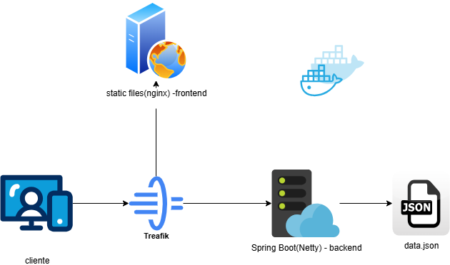
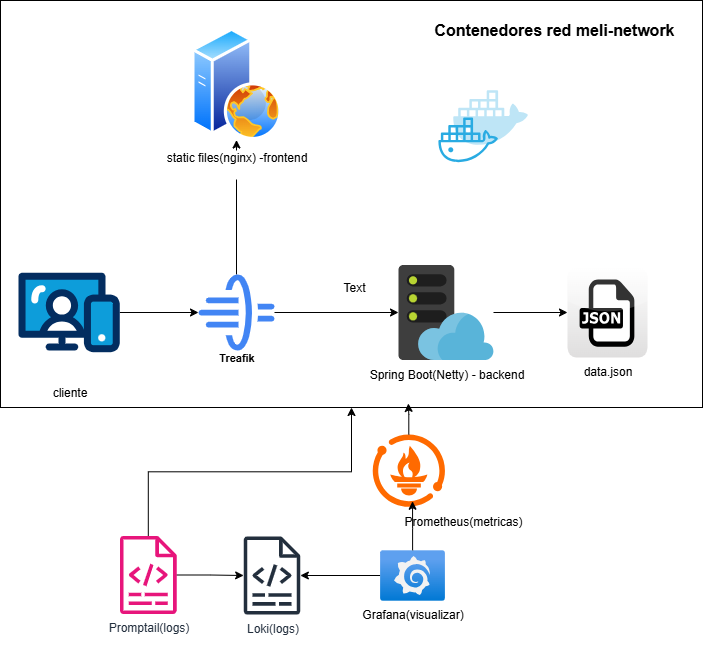

[Volver al README Principal](../README.md)

# Arquitectura del Proyecto MELI Product

Este documento describe la arquitectura general del proyecto MELI Product, abarcando tanto la infraestructura de despliegue como los componentes de observabilidad.

## 1. Arquitectura de Infraestructura

La aplicación MELI Product está diseñada como un sistema de microservicios orquestado con Docker Compose, utilizando un proxy inverso para el enrutamiento del tráfico. A continuación, se presenta un diagrama que ilustra los componentes principales y sus interacciones a nivel de infraestructura:

**Componentes Clave:**

*   **Cliente:** Representa a los usuarios que interactúan con la aplicación a través de navegadores web o dispositivos móviles.
*   **Traefik (API Gateway / Load Balancer):** Actúa como el punto de entrada principal para todas las solicitudes externas. Se encarga del enrutamiento del tráfico hacia los servicios `frontend` y `backend` basándose en reglas configurables (Host, PathPrefix). También proporciona funcionalidades de balanceo de carga, reintentos y circuit breaking.
*   **Frontend (Nginx / React):** Un contenedor Nginx que sirve los archivos estáticos de la aplicación React. Es la interfaz de usuario con la que interactúa el cliente.
*   **Backend (Spring Boot / Netty):** Un microservicio desarrollado con Spring Boot que utiliza Netty como servidor web embebido. Este servicio expone las APIs necesarias para la lógica de negocio de la aplicación. Los datos son consumidos desde un archivo `data.json` montado como volumen.
*   **data.json:** Un archivo JSON que actúa como fuente de datos para el microservicio `backend`.

## 2. Arquitectura de Observabilidad

Para garantizar la visibilidad sobre el comportamiento y el rendimiento de la aplicación, se ha implementado una pila de observabilidad que incluye recolección de métricas y logs. El siguiente diagrama detalla los componentes involucrados en esta arquitectura:

**Componentes Clave de Observabilidad:**

*   **Prometheus:** Sistema de monitoreo y alerta que recolecta métricas de los servicios expuestos (principalmente del `backend` a través de su endpoint `/actuator/health` y otros endpoints de métricas). Prometheus almacena estas métricas en una base de datos de series de tiempo.
*   **Grafana:** Plataforma de visualización de datos que se conecta a Prometheus para crear dashboards interactivos y alertas, permitiendo una comprensión clara del estado y rendimiento de la aplicación.
*   **Loki:** Un sistema de agregación de logs diseñado para almacenar y consultar logs de manera eficiente. Loki se enfoca en indexar metadatos de los logs en lugar de los logs completos, lo que lo hace muy escalable.
*   **Promtail:** Un agente cliente que se encarga de recolectar logs de los contenedores de Docker y enviarlos a Loki. Promtail está configurado para leer los logs de los servicios `frontend` y `backend`.

---

**Nota:** Los archivos editables de los diagramas (`.drawio`) se encuentran en la carpeta `docs/` de este proyecto, permitiendo su fácil modificación y actualización en la herramienta https://app.diagrams.net/ de forma gratuita.